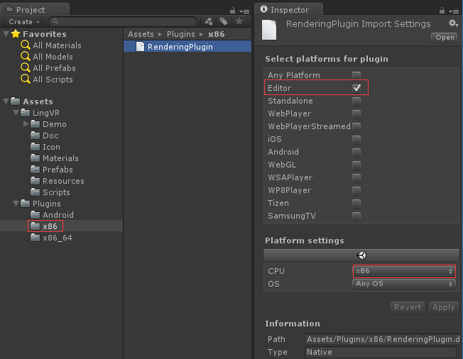
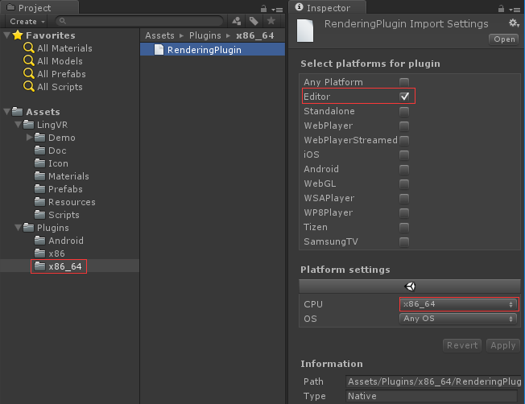
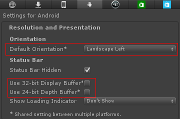
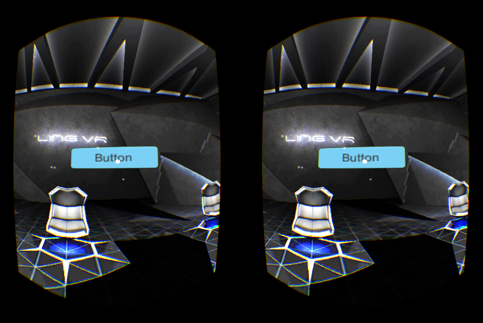
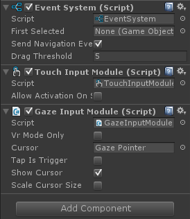
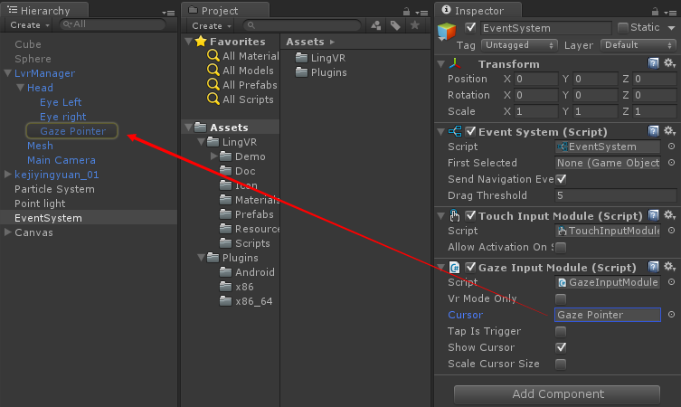
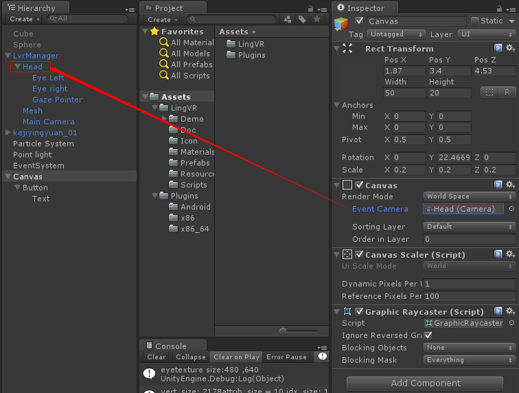
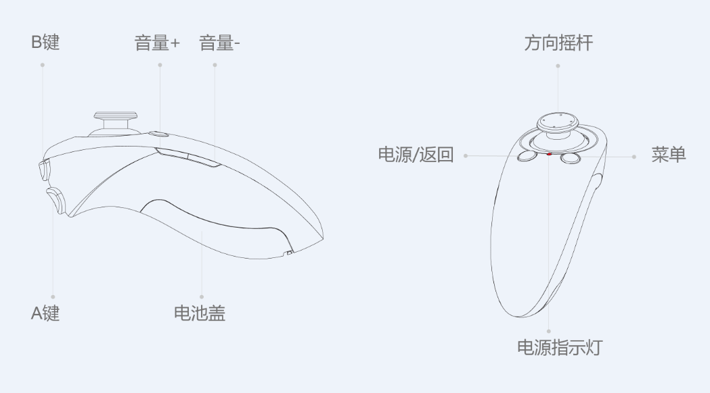
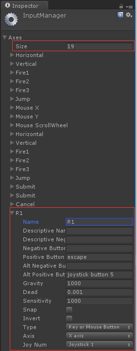

# 使用 SDK
开始使用 SDK 制作 VR 应用吧!

## 内容

导入 SDK 后的目录结构如下：

	Assets\
		LingVR\
			Demo\					// demo 相关
			Doc\					// 版本更新说明
			Materials\				// 材质
			Prefabs\				// 预制物体
			Resources\				// 着色器和相关贴图
			Scripts\				// SDK 脚本
			Icon\					// LingVR icon
		Plugins\					// 各个平台的动态库

## 集成步骤

只需要简单的几步就可以集成 SDK。

### 1.导入 SDK

* Unity 4.x

	通过 Assets -> Import Package -> Custom Package 菜单导入即可

* Unity 5.x

	通过 Assets -> Import Package -> Custom Package 菜单导入后，需要修改两个 .so 文件的属性：
	
	
	
	

### 2.项目设置

因为 VR 应用的特殊性，必须把设备朝向设置成 Landscape Left 。其他朝向会导致程序初始化的时候退出。

同时，出于性能考虑，禁用 32-bit Display Buffer 和 24-bit Depth Buffer:

如果需要支持灵境小白 1S 的外接传感器，则要在 AndroidMenifest.xml 中添加一个服务：

	<service android:name="com.lingvr.sensorbox.UdService3"></service>
	
和三个权限：

	<uses-feature android:name="android.hardware.usb.host" />
	<uses-permission android:name="com.android.example.USB_PERMISSION"/>
	<uses-permission android:name="android.permission.WRITE_EXTERNAL_STORAGE"/>

### 3.添加双目相机

VR 相机由 LvrManager 统一管理。只需要将 Prefabs 目录下的 LvrManager 预制体拖拽到场景中，就能看到双目效果。

在 Editor 中可以通过按住 Ctrl 或者 Alt 键拖动鼠标，模拟头部转动。

别忘了移除场景中的其他相机。

另外 LvrManager 提供了一些参数：

* Glass -> 选择适配的眼镜类型
* Eye Texture Scale -> 调整双眼分辨率，范围为原分辨率的 0.0 ~ 1.0
* Use Unity Remote Input -> 是否使用 [Unity Remote 4](http://docs.unity3d.com/Manual/UnityRemote4.html) 调试工具获取手机传感器数据

### 4.用户交互

#### 1.Gaze Pointer

VR 眼镜属于可穿戴设备，不能使用普通的触屏事件交互。我们提供了一种 Gaze Pointer 来模拟 3D 虚拟世界中的“光标”。

这个 3D 光标在 GazeInputModule.cs 脚本中实现，它是 Unity Input Module 的一个拓展。

使用时，先在场景中通过 GameObject -> UI -> Event System 创建一个 EventSystem 对象，

为这个对象添加 GazeImputModule.cs 脚本:

注意！`GazeInputModule` 的 Cursor 对象要绑定到 LvrManager 预制体下的 Gaze Pointer：

另外，要使场景内的 UI 能够响应 Gaze Pointer 事件，需要把该 UI 所处的 Canvas 的 EventCamera 指定到 LvrManager 预制体的 MainCamera：

这样场景内的 UI 就能捕捉到 Gaze cusor 事件了。

#### 2.手柄

我们为灵境小白配置的手柄使用了安卓标准键值：

|        |     |                      |
|--------|-----|----------------------|
| 返回键 | 4   | KEYCODE_BACK         |
| 菜单键 | 103 | KEYCODE_BUTTON_R1    |
| 音量+  | 24  | KEYCODE_VOLUME_UP    |
| 音量-  | 25  | KEYCODE_VOLUME_DOWN  |
| A键    | 96  | KEYCODE_BUTTON_A     |
| B键    | 97  | KEYCODE_BUTTON_B     |
| 摇杆上 | 19  | KEYCODE_DPAD_UP      |
| 摇杆下 | 20  | KEYCODE_DPAD_DOWN    |
| 摇杆左 | 21  | KEYCODE_DPAD_LEFT    |
| 摇杆右 | 22  | KEYCODE_DPAD_RIGHT   |

注意：这里的菜单键实际映射的是 R1 键！需要在 Edit -> Project Settings -> Input 菜单里额外配置一下：

你可以通过设置绑定在 LvrManager 下的 `LvrController` 中的 `useController = true` 来启用手柄，然后获取键值的当前状态：

	kv = LvrController.keyValues;
	
`keyValues` 是一个 `KeyValuse` 结构体，里面包含了所有键值当前状态：

	public struct KeyValues
	{
		public bool buttonA;
		public bool buttonB;
		public bool buttonBack;
		public bool buttonR1;
		public float axisX;
		public float axisY;
	}
		
然后你就可以通过获取这些键值的状态来处理一些事件了，比如：

	void Update()
	{
		if (kv.buttonA)
			attack();
		if (kv.buttonB)
			jump();
		if (kv.buttonBack)
			pause();
	}