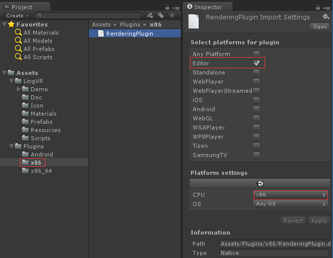
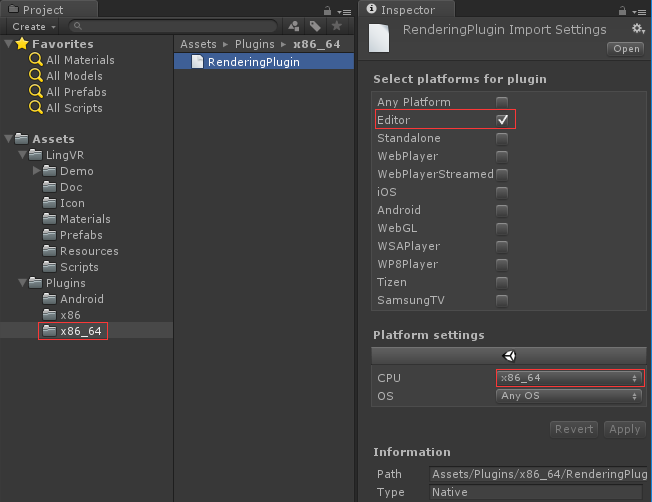

# Using SDK
Start to use SDK making VR apps!

## Content 

Catalog structure is as follows after importing SDK:

	Assets\
		LingVR\
			Demo\					
			Doc\				
			Materials\				
			Prefabs\				
			Resources\				
			Scripts\				
			Icon\					
		Plugins\					

## Integration stage

Only simple steps are needed to use SDK.

### 1.Importing SDK

* Unity 4.x

	Importing through Assets -> Import Package -> Custom Package

* Unity 5.x

	After importing through Assets -> Import Package -> Custom Package, two property of .so file need to be modified:
	
	
	
	

### 2.Project settings

Because of the speciallity of VR apps, the device orientations should be set as Landscape Left. Other orientations will cause exit programme when initializing.
At the same time, based on performance concerns, 32-bit Display Buffer and 24-bit Depth Buffer are prohibited:

If you need support of using LING BAI 2's external sensor, a service should be added in AndroidMenifest.xml:

	<service android:name="com.lingvr.sensorbox.UdService3"></service>
	
and three authorities also needed：

	<uses-feature android:name="android.hardware.usb.host" />
	<uses-permission android:name="com.android.example.USB_PERMISSION"/>
	<uses-permission android:name="android.permission.WRITE_EXTERNAL_STORAGE"/>

### 3.Adding binocular camera

VR cameras are under management of LvrManager. You could see binocular effect by just drag the LvrManager prefabricated object under Prefabs catalog into the scene. 

You can simulate head rolling by holding Ctrl/ALT and draging cursor.

Do not forget to remove other cameras in the scene.

also LvrManager provides some parameters:

* Glass -> to choose which mobile headset that you are developing;
* Eye Texture Scale -> adjusting eye resolution, ranged from 0.0 ~ 1.0;
* Use Unity Remote Input -> whether to use [Unity Remote 4](http://docs.unity3d.com/Manual/UnityRemote4.html) adjusting tool to acquire phone sensor data.

### 4.User interactions

#### 1.Gaze Pointer

VR headset is a wearable device that can and should not interact with touch screen. We provide a Gaze Pointer to simulate "cursor" in 3D virtual world.

This 3D cursor can be realized in GazeInputModule.cs script which is a expansion of Unity Input Module.

You can create a EventSystem target through GameObject -> UI -> Event System in the scene when applying,

How to add GazeImputModule.cs script:

Attention！The Cursor target `GazeInputModule` need to bound with Gaze Pointer LvrManager prefabricated object

In addition, UI in the scene can react with Gaze Pointer event when pointing the EventCamera of the Canvas of this UI to MainCamera of LvrManager prefabricated object:

In this way can UI in the scene capture the Gaze cusor event.

#### 2.Controller

We have used Android standard key value in BAI's controller:

|                |     |                      |
|----------------|-----|----------------------|
|      Back      | 4   | KEYCODE_BACK         |
|      Menu      | 103 | KEYCODE_BUTTON_R1    |
|    Volume+     | 24  | KEYCODE_VOLUME_UP    |
|    Volume-     | 25  | KEYCODE_VOLUME_DOWN  |
|       A        | 96  | KEYCODE_BUTTON_A     |
|       B        | 97  | KEYCODE_BUTTON_B     |
| Joystick up    | 19  | KEYCODE_DPAD_UP      |
| Joystick down  | 20  | KEYCODE_DPAD_DOWN    |
| Joystick left  | 21  | KEYCODE_DPAD_LEFT    |
| Joystick right | 22  | KEYCODE_DPAD_RIGHT   |

Attention：The Menu key here is actually mapping to the key R1. You need to do extra configratio in Edit -> Project Settings -> Input：

You could set `useController = true` under `LvrController` of LvrManager to activate controller, and then acquiring the current status of controller.

	kv = LvrController.keyValues;
	
`keyValues` is a `KeyValues` structure that contains every key's current status:

	public struct KeyValues
	{
		public bool buttonA;
		public bool buttonB;
		public bool buttonBack;
		public bool buttonR1;
		public float axisX;
		public float axisY;
	}
		
and then you can handle some events by acquiring some key values, for example:

	void Update()
	{
		if (kv.buttonA)
			attack();
		if (kv.buttonB)
			jump();
		if (kv.buttonBack)
			pause();
	}